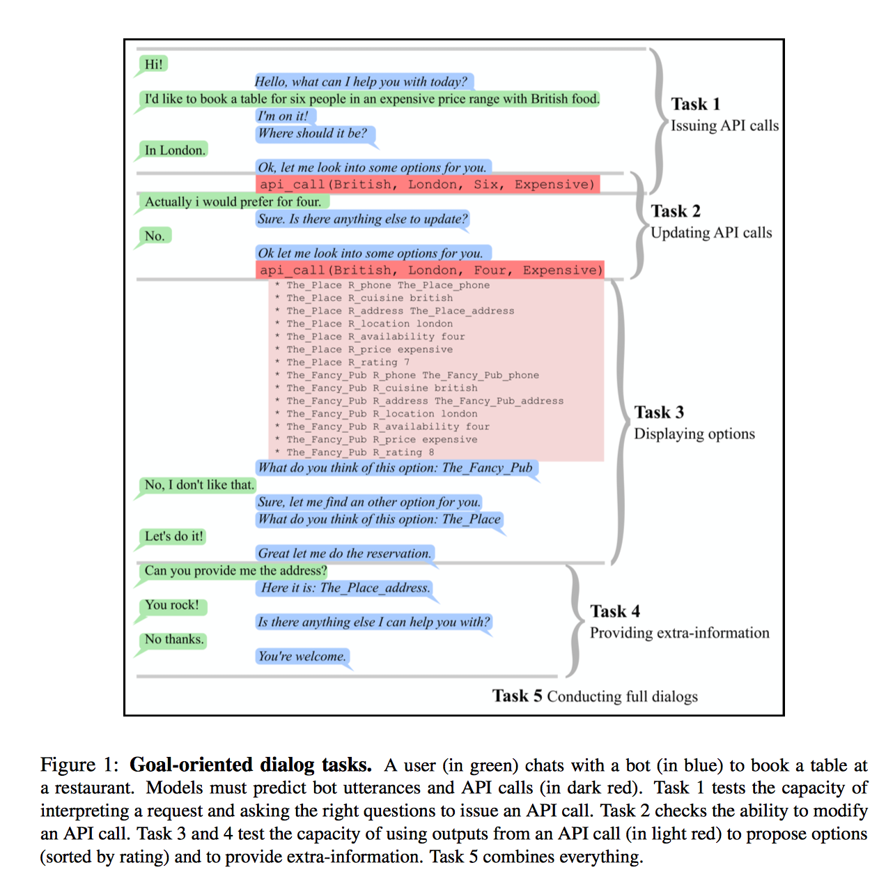
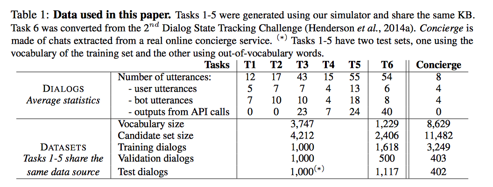
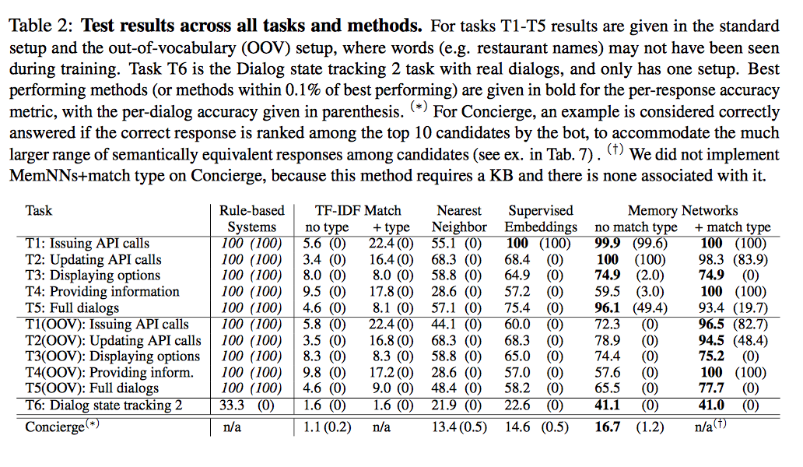

- Ссылка на статью: [arXiv](https://arxiv.org/abs/1605.07683v3)
- Ссылка на датасет: [https://scontent-lax3-1.xx.fbcdn.net/t39.2365-6/13437784_1766606076905967_221214138_n.tgz](https://scontent-lax3-1.xx.fbcdn.net/t39.2365-6/13437784_1766606076905967_221214138_n.tgz).


# Общее описание

End-to-end диалоговые системы на нейросетях, обученные предсказывать следующую фразу
на основе предыдущих, показывают многообещающие результаты на диалогах "ниочем".
Будут ли эти методы показывать хорошие результаты на целевых диалогах (goal oriented)?
Этот вопрос пока открыт, из-за отсутствия золотого стандарта.

В данной статье представлен open source фреймворк для генерирования такого золотого стандарта
и собственно сам золотой стандарт сгенерированный с помощью этого фреймворка.
Золотой стандарт является синтетическим датасетом в духе bAbI и представлен предметной
областью заказа столика в ресторане. Для генерации датасета была создана база знаний
ресторанов (локация, кухня, вместимость, ценовая категория).

Задачи, которые решаются в статье в рамках целевого диалога:
1. Обращение к API в первый раз (Issuing API calls).
2. Обращение к API с целью обновления (Updating API calls).
3. Показ и итерация по вариантам заведений (Displaying options).
4. Показ дополнительной информации о выбранном заведении (Providing extra-information).
5. Ведение полноценного целевого диалога (Conducting full dialogs, объединение предыдущих пунктов).
6. Ведение полноценного диалога на датасете Dialog State Tracking Challenge 2 (DSTC 2).



2 метрики оценки качества (evaluation):
1. Точность по репликам (per-response accuracy) - процент правильных реплик чатбота.
2. Точность по диалогам (per-dialog accuracy) - процент правильных диалогов проведенных чатботом.
Точность считалась в рамках задачи ранжирования (выбрать из всех имеющихся фраз наиболее подходящую в качестве ответа).

Пример из датасета для 1 задачи:
```
1 hello	hello what can i help you with today
2 can you book a table for six people with french food	i'm on it
3 <SILENCE>	where should it be
4 in bombay	which price range are looking for
5 i am looking for a cheap restaurant	ok let me look into some options for you
6 <SILENCE>	api_call french bombay six cheap
```

В первой колонке представлен номер реплики в диалоге, во второй реплика пользователя,
в третьей реплика диалогового агента.

# Описание датасета

Статистика датасета:


## bAbI

Датасет генерировался используя небольшую базу знаний о ресторанах.
Каждый ресторан определяется:
- типом кухни (10 разных типов),
- локацией (10 вариантов),
- ценовой категорией (3 варианта),
- рейтингом (от 1 до 8),
- вместимостью (4 варианта),
- адресом,
- телефонным номером,
- названием.

Первым делом создавался запрос к базе знаний, например `[cuisine: British, location: London, party size: six, price range: expensive]`,  затем семплировался один результат, например ресторан `sala_thong`.
Затем имея такие данные генерировался диалог между пользователем и ботом. Для
генерации фраз применялись вручную заданные правила (20 для бота и 43 для пользователя).

Размер базы знаний: 4200 фактов и 600 ресторанов.

## DSTC 2

Другой датасет, DSTC2, был сконвертирован в формат пригодный для тестирования
в end-to-end манере.

Пример:
```
1 <SILENCE>	Hello , welcome to the Cambridge restaurant system . You can ask for restaurants by area , price range or food type . How may I help you ?
2 expensive restaurant in the south part of town	What kind of food would you like?
3 any	the good luck chinese food takeaway is a nice restaurant in the south of town serving chinese food
4 address	Sure , the good luck chinese food takeaway is on the_good_luck_chinese_food_takeaway_address
5 type of food	the good luck chinese food takeaway is a nice restaurant in the south of town in the expensive price range
6 thank you good bye	 you are welcome
```

Стоит отметить, что сконвертированный датасет непригоден для сравнения результатов
с оригинальным DSTC2, т.к. тут предсказывается реплика, а не заполняются
слоты.

# Модели и результаты

В данной статье рассмотрено несколько моделей. Самая интересная Memory Network.
В конспекте будет рассмотрена только одна из них.

Результаты



## Supervised embedding models

Хорошим бейслайном является использование векторных представлений слов
для оценивания пары (контекст диалога, реплика) (conversation history, response),
т.е. насколько хорошо реплика подойдет под контекст диалога.

Модель учат предсказывать реплику при имеющемся контексте:
[Supervised embedding model](supervised-embeddings.png)


# Заключение

Точность по репликам многообещающая (41% на DSTC2), но по диалогу в целом (0% на DSTC2),
работать и работать.
