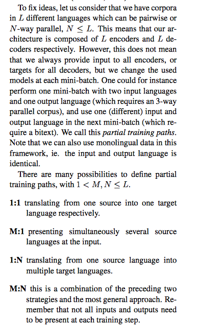
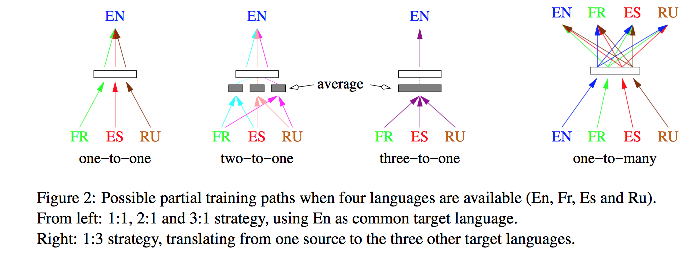
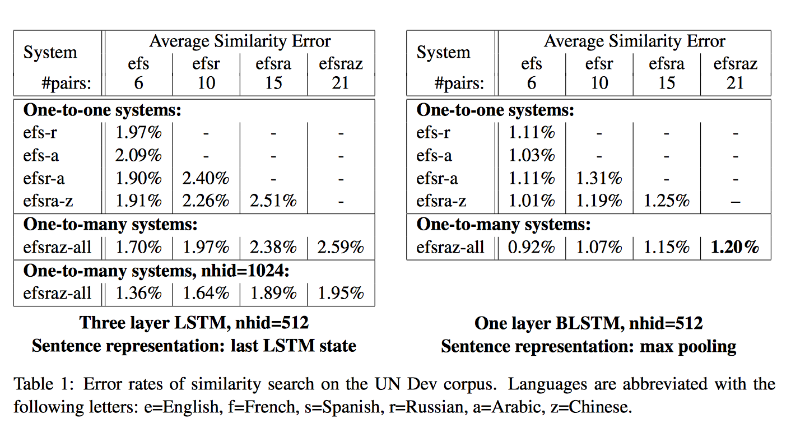
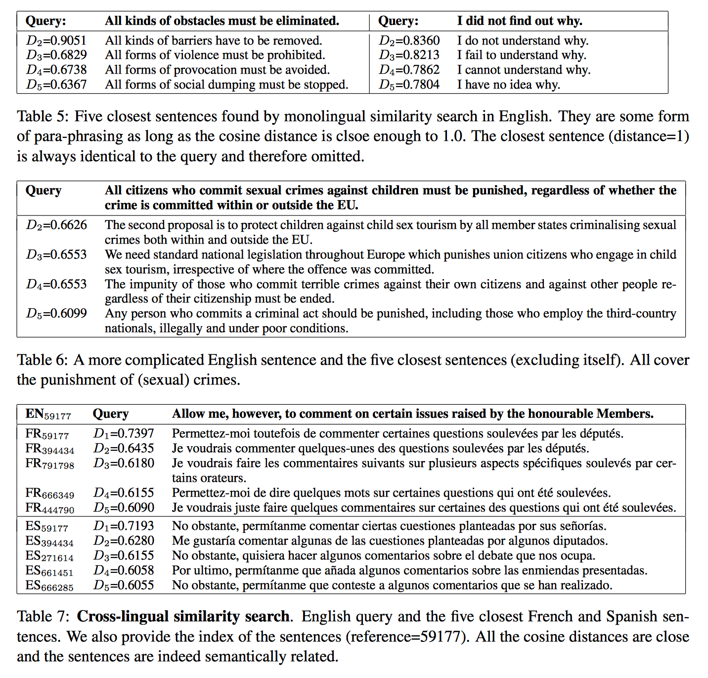

- Learning Multilingual Joint Sentence Embeddings with Neural Machine Translation [[ACL](https://research.fb.com/wp-content/uploads/2017/08/multiling_repl4nlp17_fair.pdf)]

# Введение

- Цель: получение мультиязычного (в интерлингве)
векторного представления предложения

  - семантически близкие предложения из разных языков должны лежать рядом,
  - возможность мультиязычного поиска.

- Методы базируются на seq2seq с несколькими энкодерами
и декодерами.
- После обучения, для получения векторых представлений, использовались только энкодеры.

- Методы требуют параллельных корпусов.

# Основная мысль

Имеется L-языковой корпус. Т.е. архитектура имеет L-энкодеров и декодеров.
Используемые энкодеры, декодеры задаются в каждом мини-батче (зависят от языков).

- 1:1 - для каждого языка свой энкодер. Один декодер (только один язык в декодере).
Пример: efs - r (eng-enc, fr-enc, spain-enc) => (rus-dec).
Минус - не получаем векторное представления для языка из энкодера.

- N:1 - для каждого языка свой энкодер. После, происходит
подсчет среднего векторного представления энкодера для N языков. Один декодер.

- 1:M - для каждого языка свой энкодер. Для каждого из M языков свой декодер.
Пример: ef - efs (eng-enc, fr-enc, spain-enc) => (eng-dec, fr-dec, spain-dec).

- N:M - общий случай предыдущих.

# Оценка качества

Проходимся по всем предложениям и считаем ошибкой среднюю величину несовпадения
референсного и найденного перевода.

# Результаты

- Лучшим оказался метод на основе 1:M.
- M:1 оказался хуже (нет в картинке). Возможно из-за того, что считалось среднее. Может быть замена
на что-нибудь более хитрое улучшит результаты.

# Интересные моменты

- BPE помогает снизить эффект опечаток.
- К сожалению нет результатов на SemEval, из-за этого не понятно насколько хорош метод
на независимых дорожках.
- 1-layer BLSTM-512 + Max Pooling лучше чем 3-layer LSTM-1024 + last LSTM state.
- Facebook FAISS хорош для подсчета расстояний на большом количестве данных.

## Примеры

